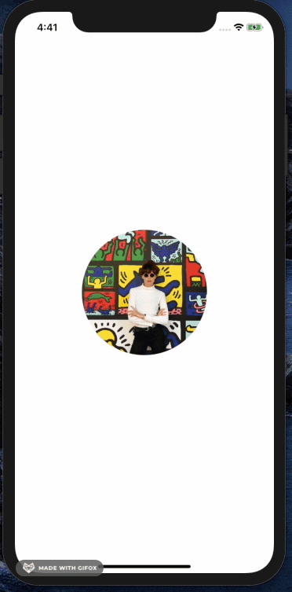
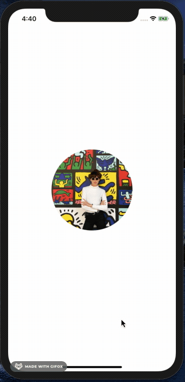

## TouchDelivery
Debugging Gesture Recognizers Example

## What this does
* shows how to properly allow user interaction of UIViews
* provides example of hit-testing to debug gesture recognizers that may not be firing properly

## Tech debt
* n/a, Pods included in project for layout, please install to run properly.

## How I tested it
* manual, used iPhone 11 simulator but should work with all device types. 

## What it looks like
* Before: 

* After: 

